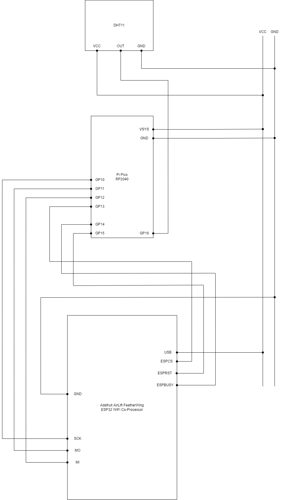

# Setup

## Prerequisites

Obtain following parts:

### Boards and Sensors

- [Raspberry Pi Pico](https://www.raspberrypi.com/products/raspberry-pi-pico/)
- [Adafruit AirLift FeatherWing - ESP32 WiFi
  Co-Processor](https://learn.adafruit.com/adafruit-airlift-featherwing-esp32-wifi-co-processor-featherwing)
- [HiLetgo DHT11
  sensor](https://www.amazon.com/HiLetgo-Temperature-Humidity-Digital-3-3V-5V/dp/B01DKC2GQ0)

### Misc

- Micro-USB cable
- Breadboard
- Wires
- Solder
- Soldering iron


## Setup weather reporter

Adapted from: https://www.tomshardware.com/how-to/get-wi-fi-internet-on-raspberry-pi-pico

Assemble electronics according to following diagram:

.

Download and install [CircuitPython 7.x firmware for
Pico](https://learn.adafruit.com/welcome-to-circuitpython/installing-circuitpython).

Download a 7.x release of [Adafruit CircuitPython
Bundle](https://github.com/adafruit/Adafruit_CircuitPython_Bundle/releases) and
add following libraries to the Pico's `lib` directory:

- `adafruit_bus_device`
- `adafruit_esp32spi`
- `adafruit_requests.mpy`

Download a 7.x release of [Adafruit CircuitPython
DHT](https://github.com/adafruit/Adafruit_CircuitPython_DHT) and add
`adafruit_dht.mpy` into Pico's `lib` directory.

Copy the following files from the `weather-reporter` directory into the Pico's
top-level directory:

- `code.py`
- `utils.py`
- `secrets.sample.py`


## Setup receiver worker namespace

Enter `receiver` directory.

Setup KV namespaces with:

```
wrangler kv:namespace create WEATHER --preview
wrangler kv:namespace create WEATHER
```

Create a copy of `wrangler.toml` from `wrangler.sample.toml` and fill with
credentials.

Deploy worker with:

```
wrangler publish
```


## Connect weather reporter to receiver

Generate an API access token for the reporter by going to the [API tokens
page](https://dash.cloudflare.com/profile/api-tokens). On the page, create a
custom token and give it `Workers KV Storage:Edit` under Permissions. Save the
token value.

In the Pico's top-level directory, rename `secrets.sample.py` to `secrets.py`
and fill with appropriate credentials.

Once code is installed on Pico, you can debug it through a serial connection in
PuTTY ([see
details](https://www.tomshardware.com/how-to/get-wi-fi-internet-on-raspberry-pi-pico#running-the-code-for-wi-fi-on-raspberry-pi-pico-xa0)).


## Seeing graphed data

Allow weather station to report data for a few hours.

Edit `www/index.html` and fill in `API_URL` with worker endpoint URL.

Open `index.html` in browser.